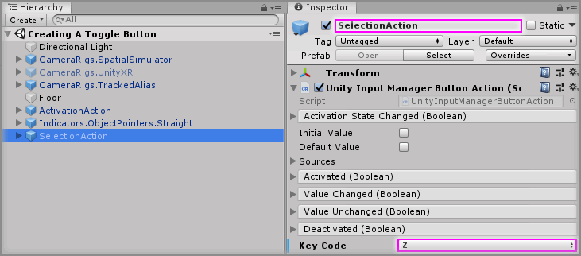
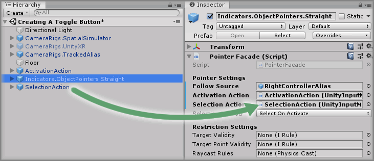
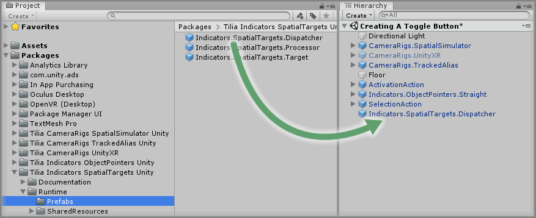
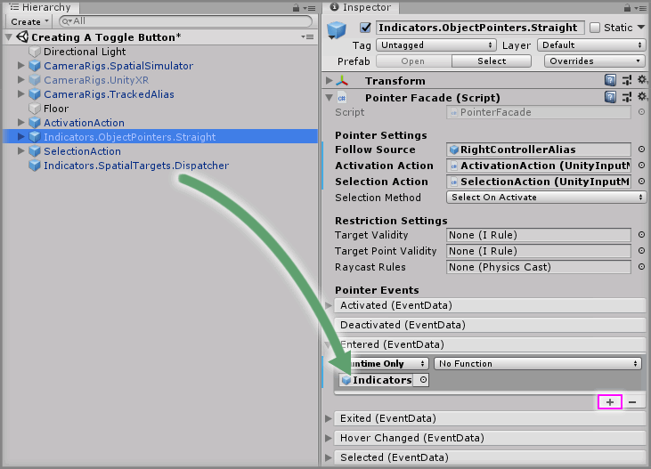
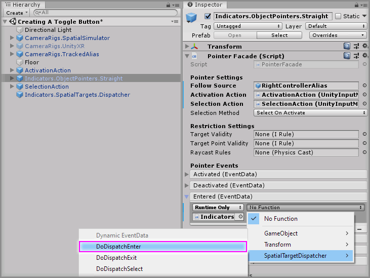
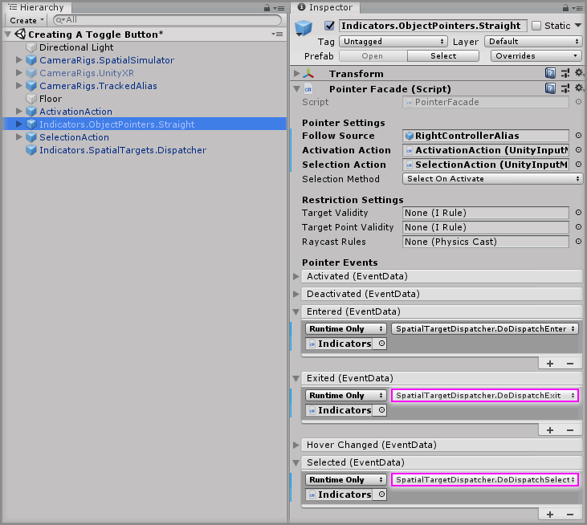
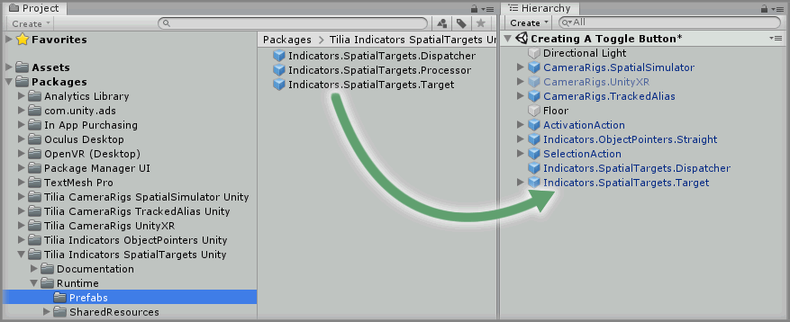
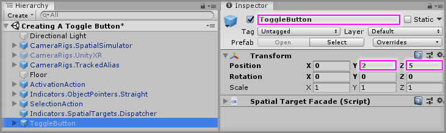
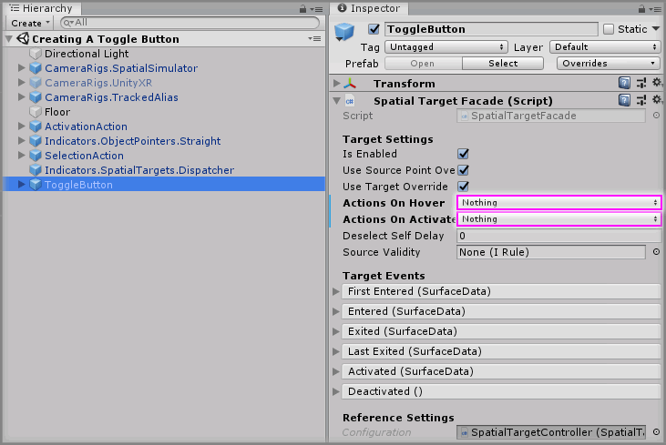
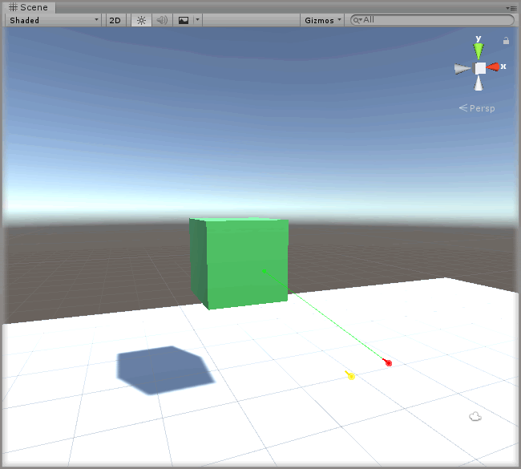

# Creating A Toggle Button

> * Level: Beginner
>
> * Reading Time: 10 minutes
>
> * Checked with: Unity 2018.3.14f1

## Introduction

Creating 3D user interfaces in spatial computing can be achieved by using collidable 3D objects that can be interacted with via Interactors or Pointers. We're going to set up a simple button that can be toggled between two states of on or off using the `Indicators.SpatialTargets.Target` prefab to represent our button and the `Indicators.ObjectPointers.Straight` prefab for our spatial pointer that can interact with the button.

## Prerequisites

* [Add the Tilia.Indicators.ObjectPointers.Unity -> Indicators.ObjectPointers.Straight] prefab to the scene hierarchy.
* [Install the Tilia.Indicators.SpatialTargets.Unity] package dependency in to your [Unity] project.

## Let's Start

### Step 1

We're going to start by extending our Object Pointer and giving it a selection action as the [Adding A Straight Pointer] guide only sets up the activation action for the pointer.

Select the `Input.UnityInputManager.ButtonAction` from the Unity Hierarchy window and duplicate this GameObject by right clicking on the `Input.UnityInputManager.ButtonAction` GameObject and selecting `Duplicate` from the context menu.

Rename the duplicated `Input.UnityInputManager.ButtonAction (1)` to `SelectionAction`.

> You can rename the `Input.UnityInputManager.ButtonAction` GameObject to `ActivationAction` too if you wish.

Select the `SelectionAction` GameObject from the Unity Hierarchy window and on the `Unity Input Manager Button Action` component change the `Key Code` property value to `Z`.

### Step 2

Drag and drop the `SelectionAction` GameObject into the `Selection Action` property on the `Pointer Facade` component within the `Indicators.ObjectPointers.Straight` GameObject.

### Step 3

We need to now set up some glue between our Object Pointer and our Spatial Target. We don't want to have our Object Pointer have to know about every single Spatial Target in the scene as there could be many and it would be a pain to maintain all of these links.

We can use the `Indicators.SpatialTargets.Dispatcher` prefab, which acts as a separation layer for our Spatial Targets. Our Object Pointer only needs to know about our Dispatcher and our Dispatcher knows about our Spatial Targets. This means for any communication between our Object Pointer and our Spatial Targets will go through a Dispatcher.

Expand the `Tilia Indicators SpatialTargets Unity` package directory in the Unity Project window and select the `Packages -> Tilia Indicators SpatialTargets Unity -> Runtime -> Prefabs` directory then drag and drop the `Indicators.SpatialTargets.Dispatcher` prefab into the Unity Hierarchy window.

### Step 4

We now need to hook our Object Pointer up to our Dispatcher so the Enter/Exit/Select events of our Object Pointer call the relevant methods on our Dispatcher.

Select the `Indicators.ObjectPointers.Straight` GameObject from the Unity Hierarchy window and click the `+` symbol in the bottom right corner of the `Entered` event parameter on the `Pointer Facade` component.

Drag and drop the `Indicators.SpatialTargets.Dispatcher` GameObject into the event listener box that appears on the `Entered` event parameter on the `Pointer Facade` component that displays `None (Object)`.

Select a function to perform when the `Entered` event is emitted. For this example, select the `SpatialTargetDispatcher -> DoDispatchEnter` function (be sure to select `Dynamic EventData - DoDispatchEnter` for this example).

### Step 5

Do the same as [Step 4] but for the `Exited` and `Selected` event parameters in the `Pointer Facade` component, choose the appropriate function to be called:

* `Exited` -> `SpatialTargetDispatcher -> DoDispatchExit`
* `Selected` -> `SpatialTargetDispatcher -> DoDispatchSelect`

### Step 6

We now have a Spatial Target Dispatcher in our scene all set up to accept events from our Object Pointer and dispatch the appropriate method to whatever Spatial Target is in the scene. So now all we need to do is add a Spatial Target to our scene to create our simple toggle button.

Expand the `Tilia Indicators SpatialTargets Unity` package directory in the Unity Project window and select the `Packages -> Tilia Indicators SpatialTargets Unity -> Runtime -> Prefabs` directory then drag and drop the `Indicators.SpatialTargets.SpatialTarget` prefab into the Unity Hierarchy window.

### Step 7

Select the `Indicators.SpatialTargets.SpatialTarget` GameObject in the Unity Hierarchy window and change the Transform Properties to:

* Position: `X = 0, Y = 2, Z = 5`

Rename the `Indicators.SpatialTargets.SpatialTarget` GameObject to `ToggleButton`.

### Step 8

With the `ToggleButton` GameObject still selected in the Unity Hierarchy window, on the `Spatial Target Facade` component set the following properties to:

* Actions On Hover: `Nothing`
* Actions On Activate: `Nothing`

### Step 9

Play the Unity scene and press the `Space` key to activate the Straight Pointer and hover the pointer over the Spatial Target cube, notice how the color on our Spatial Target changes to the hover color, this is because our Spatial Target Dispatcher has Enter/Exit events set up to know when the Object Pointer is hovering over our Spatial Target cube.

Press the `Z` key, whilst the Straight Pointer is hovering over the Spatial Target cube to `Activate` the Object Pointer, which in turn activates our Spatial Target cube. You'll notice now the Spatial Target cube shows the activated state meaning our Spatial Target cube is now the basis of our toggle button and currently in the `On` state. Select the Spatial Target cube again with the Object Pointer and it will become deactivated and be in the `Off` state.

### Step 10

Let's delve inside our Spatial Target `ToggleButton` GameObject and see how we can customise the look of these three main states of `Normal`, `Hover` and `Activated`.

The states are just simply GameObject containers that hold different meshes for each state and if we expand the `ToggleButton -> SpatialTargetController -> VisualStates` GameObject then we can see this holds two state types for our Spatial Target:

* EnabledVisuals - These are the states of the Spatial Target if the Spatial Target is in the enabled state.
* DisabledVisuals - hese are the states of the Spatial Target if the Spatial Target is in the disabled state.

> To change the enabled state of a Spatial Target, just change the `Is Enabled` property on the `Spatial Target Facade`.

We're only going to be interested in changing our `Enabled` states for this example, so let's expand the `ToggleButton -> SpatialTargetController -> VisualStates -> EnabledVisuals` GameObject to see some more nested container states:

* NonActiveStates - The states of the Spatial Target when it has not been activated.
  * Normal - The state of the Spatial Target when the Object Pointer is not hovering over it.
  * Hovered - The state of the Spatial Target when the Object Pointer is hovering over it.
* ActiveStates - The states of the Spatial Target when it has been activated.
  * Active - The state of the Spatial Target when it is active.

These basically break down into:

* Normal - The default look of our button.
* Hovered - The look of our button when the pointer is hovering over it.
* Active - The look of our button when it has been clicked and is activated.

Each of these state containers has the same nested structure of:

* MeshContainer
  * DefaultMesh

Which just holds our default Cube mesh for each of the states, so for us to change the look of our button, we just need to disable the `DefaultMesh` GameObject within each state and add our own mesh collection to create our own button style.

One thing to notice though is that none of these default meshes have colliders on them, so any mesh we add, we can either leave the auto generated collider on or we can update the collider for the Spatial Target in the `ToggleButton -> SpatialTargetController -> CollisionVolume` GameObject. If you aren't going to use the `ToggleButton -> SpatialTargetController -> CollisionVolume -> DefaultCollider` Collider then make sure to disable it, otherwise it will cause your Object Pointer to activate the Spatial Target even if it doesn't look as if it's touching the mesh.

[Add the Tilia.Indicators.ObjectPointers.Unity -> Indicators.ObjectPointers.Straight]: https://github.com/ExtendRealityLtd/Tilia.Indicators.ObjectPointers.Unity/blob/master/Documentation/HowToGuides/AddingAStraightPointer/README.md
[Install the Tilia.Indicators.SpatialTargets.Unity]: ../Installation/README.md
[Unity]: https://unity3d.com/
[Adding A Straight Pointer]: https://github.com/ExtendRealityLtd/Tilia.Indicators.ObjectPointers.Unity/blob/master/Documentation/HowToGuides/AddingAStraightPointer/README.md
[Step 4]: #Step-4